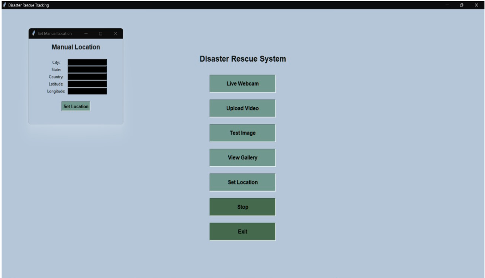
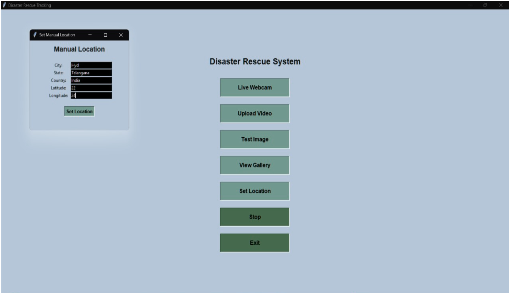
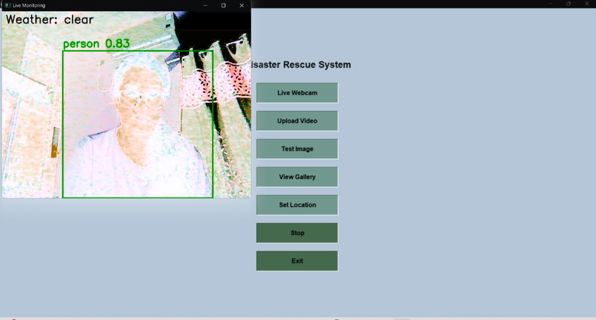

# 🚑 Human Detection in Search and Rescue (SAR) using YOLOv8

An AI-powered system designed to detect humans in disaster scenarios using computer vision. This project uses the YOLOv8 deep learning model to identify humans, animals, and vehicles from images, videos, and live webcam feeds, and sends alerts via Email and SMS.

---

# 📌 Project Overview

Search and Rescue (SAR) operations require fast and accurate identification of survivors. This system automates human detection using AI and provides real-time alerts along with location information.

---

# 🧠 AI Component

This project uses the **YOLOv8 (You Only Look Once)** object detection model from Ultralytics.

* Detects: Humans, animals, vehicles
* Provides: Bounding boxes + confidence scores
* Works on: Images, videos, and live webcam

---

# ⚙️ Features

* 🎥 Live webcam detection
* 🧪 Image detection from dataset
* 🎬 Video detection
* 📂 Detection gallery with stored frames
* 📍 Manual location input (latitude, longitude)
* 🌐 Automatic IP-based location (fallback)
* 📧 Email alerts
* 📱 SMS alerts using Twilio API
* 🖥️ Console output with detection statistics

---

# 📁 Dataset Used

This project uses:

* YOLOv8 pre-trained model (`yolov8m.pt`)
* COCO dataset (for training reference)
* Custom test images and videos stored in `test-files/`

---

# 🛠️ Requirements

Create a `requirements.txt` file with:

```
ultralytics
torch
opencv-python
numpy
tkinter
python-dotenv
```

Install dependencies:

```
pip install -r requirements.txt
```

---

# 🔐 Environment Setup (IMPORTANT)

Create a `.env` file in the root directory:

```
EMAIL_PASSWORD=your_email_app_password
TWILIO_ACCOUNT_SID=your_twilio_sid
TWILIO_AUTH_TOKEN=your_twilio_auth_token
```

⚠️ Do NOT upload `.env` to GitHub.

Add this to `.gitignore`:

```
.env
```

---

# 📲 Twilio Setup

1. Create account at https://www.twilio.com

2. Get:

   * Account SID
   * Auth Token
   * Twilio Phone Number

3. Add them in `.env` file

---

# 📧 Email Setup

* Use Gmail
* Enable **App Passwords**
* Use that password in `.env`

---

# ▶️ How to Run

Open terminal:

```
conda activate server
python Rescueprogress.py
```

---

# 🖼️ RESULTS:

---

## 🖥️ Graphical User Interface


The above figure shows the GUI interface with all available options such as live webcam, video upload, image testing, gallery, and location settings.

---

## 📍 Manual Location Configuration





The above figures show the manual location input feature where users can enter city, state, country, latitude, and longitude. If not provided, the system uses IP-based location detection.

---

## 🧪 Image Detection


The system allows selecting images from the dataset and detects humans, vehicles, and animals along with confidence scores and weather information.

---

## 🎬 Video Detection


The system processes videos frame-by-frame. Human detections increase dynamically with each frame, showing confidence scores and environmental conditions.

---

## 🎥 Live Webcam Detection




The above figures show real-time human detection using a live webcam with bounding boxes and confidence levels.

---

## 📂 Detection Gallery


The gallery stores detected frames along with:
- Time  
- Location  
- Coordinates  
- Detection details  

---

## 🖥️ Console Output


Displays real-time detection counts including:
- Persons  
- Animals  
- Vehicles  

---

## 📱 SMS Alert (Twilio)


SMS alerts are sent to the rescuer including:
- Date and time  
- Location  
- Coordinates  
- Detection counts  

---

## 📧 Email Alerts


The above figures show email notifications received when detection occurs, including full details of location and detected objects.


---

# 📊 Output

The system provides:

* Detected objects with confidence scores
* Bounding boxes on humans and objects
* Location (manual or IP-based)
* Console statistics
* SMS + Email alerts

---

# 🚀 Future Enhancements

* Improve accuracy with custom-trained dataset
* Add GPS integration
* Deploy as web application
* Add real-time drone surveillance

---

# 👩‍💻 Author

**Vaishnavi Vaitla**
GitHub: https://github.com/vaishnavi12345678999
LinkedIn: https://www.linkedin.com/in/vaishnavi-vaitla-360a1a225

---

# 📜 License

This project currently does not use a specific license. It is intended for educational and research purposes.
