# 🚑 Human Detection in Search and Rescue (SAR) using YOLOv8

An AI-powered system designed to detect humans in disaster scenarios using computer vision. This project uses the YOLOv8 deep learning model to identify humans, animals, and vehicles from images, videos, and live webcam feeds, and sends alerts via Email and SMS.

---

# 📌 Project Overview

Search and Rescue (SAR) operations require fast and accurate identification of survivors. This system automates human detection using AI and provides real-time alerts along with location information.

---

# 🧠 AI Component

This project uses the **YOLOv8 (You Only Look Once)** object detection model from Ultralytics.

* Detects: Humans, animals, vehicles
* Provides: Bounding boxes + confidence scores
* Works on: Images, videos, and live webcam

---

# ⚙️ Features

* 🎥 Live webcam detection
* 🧪 Image detection from dataset
* 🎬 Video detection
* 📂 Detection gallery with stored frames
* 📍 Manual location input (latitude, longitude)
* 🌐 Automatic IP-based location (fallback)
* 📧 Email alerts
* 📱 SMS alerts using Twilio API
* 🖥️ Console output with detection statistics

---

# 📁 Dataset Used

This project uses:

* YOLOv8 pre-trained model (`yolov8m.pt`)
* COCO dataset (for training reference)
* Custom test images and videos stored in `test-files/`

---

# 🛠️ Requirements

Create a `requirements.txt` file with:

```
ultralytics
torch
opencv-python
numpy
tkinter
python-dotenv
```

Install dependencies:

```
pip install -r requirements.txt
```

---

# 🔐 Environment Setup (IMPORTANT)

Create a `.env` file in the root directory:

```
EMAIL_PASSWORD=your_email_app_password
TWILIO_ACCOUNT_SID=your_twilio_sid
TWILIO_AUTH_TOKEN=your_twilio_auth_token
```

⚠️ Do NOT upload `.env` to GitHub.

Add this to `.gitignore`:

```
.env
```

---

# 📲 Twilio Setup

1. Create account at https://www.twilio.com

2. Get:

   * Account SID
   * Auth Token
   * Twilio Phone Number

3. Add them in `.env` file

---

# 📧 Email Setup

* Use Gmail
* Enable **App Passwords**
* Use that password in `.env`

---

# ▶️ How to Run

Open terminal:

```
conda activate server
python Rescueprogress.py
```

---

# 🖼️ RESULTS:

---

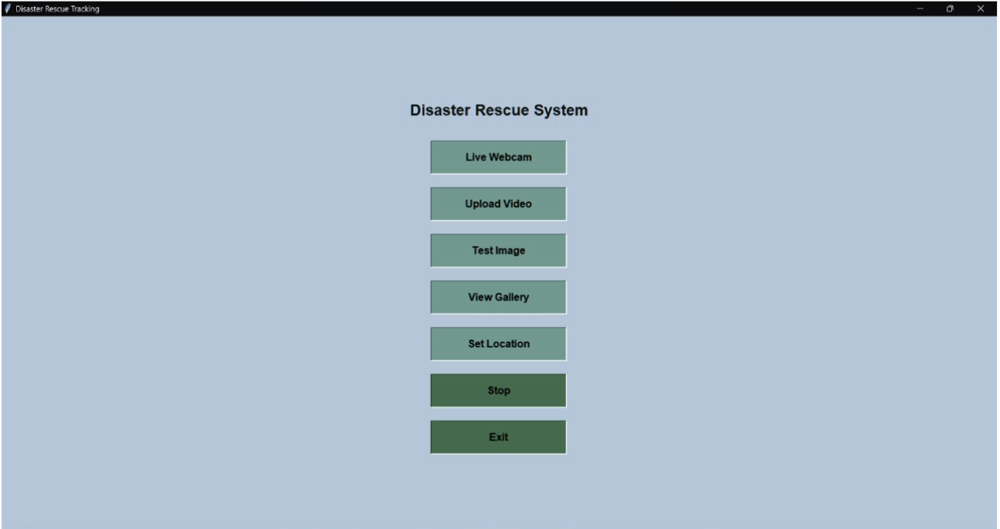

The above figure shows the output after executing the commands, which is a GUI interface with all the available options.

---

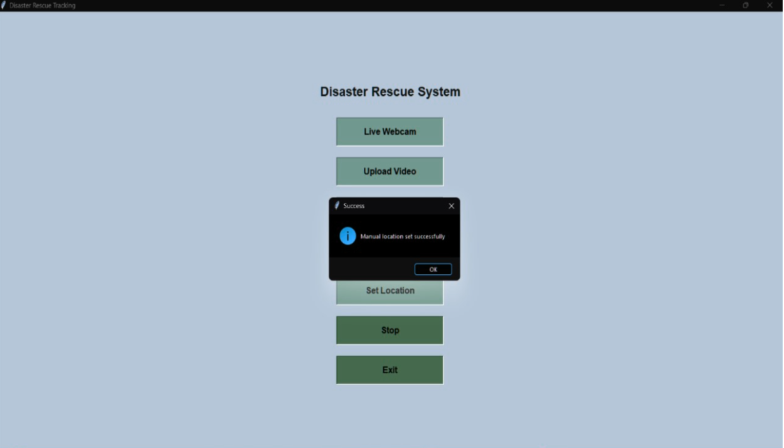

The above figure shows the functionality of setting up manual location (city, state, country, latitude, longitude), where if not set, the default IP address is used.

---

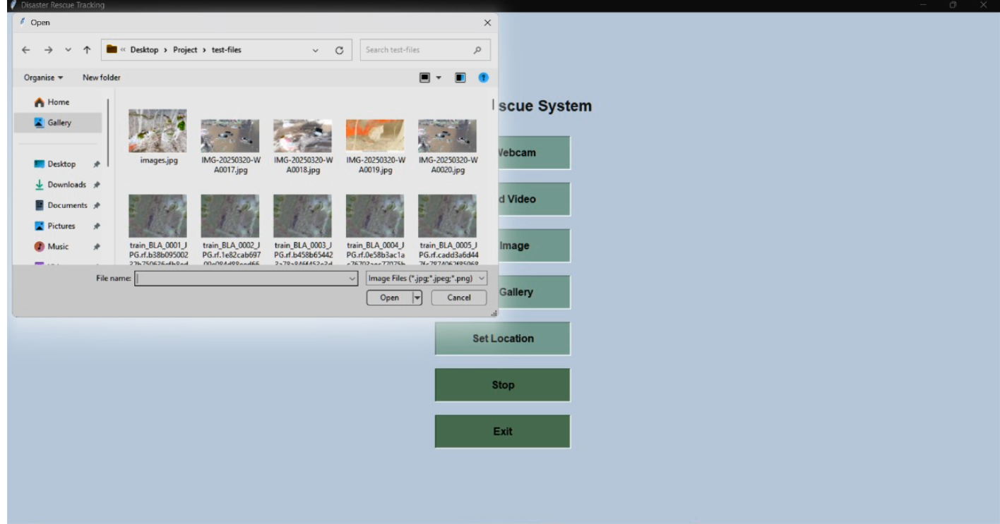

Here it is shown that we can select an image from test images dataset for detection.

---

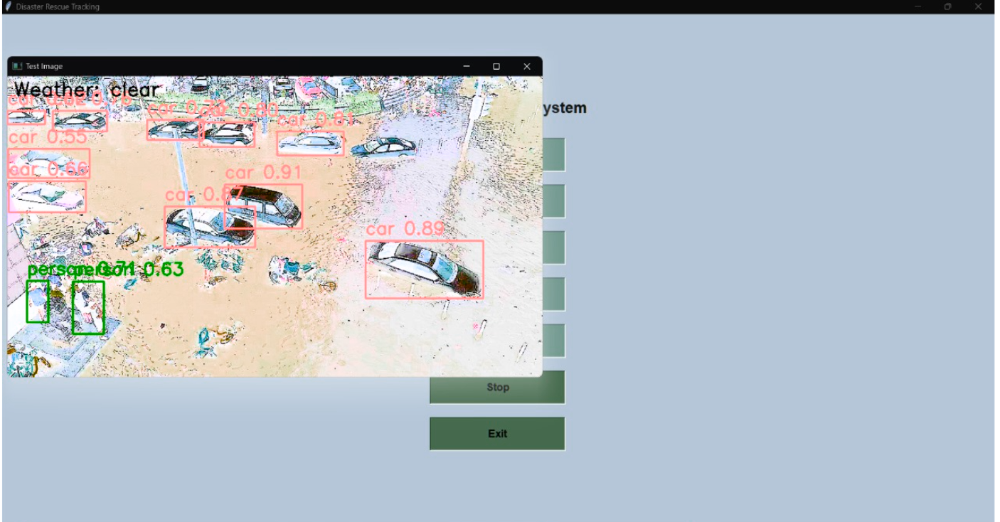

A number of cars and persons are detected in the above figure when a test image from the dataset is selected along with the weather info and accuracies of detection.

---

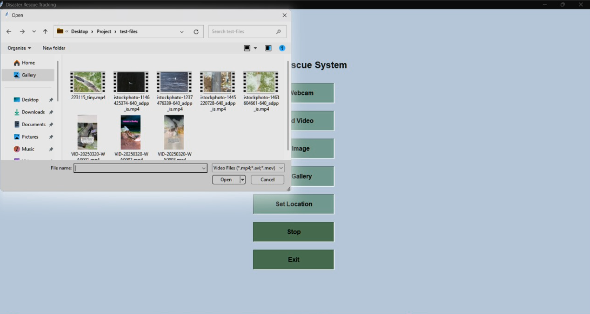

Here it is shown that we can upload a video of any length from the dataset for detection.

---

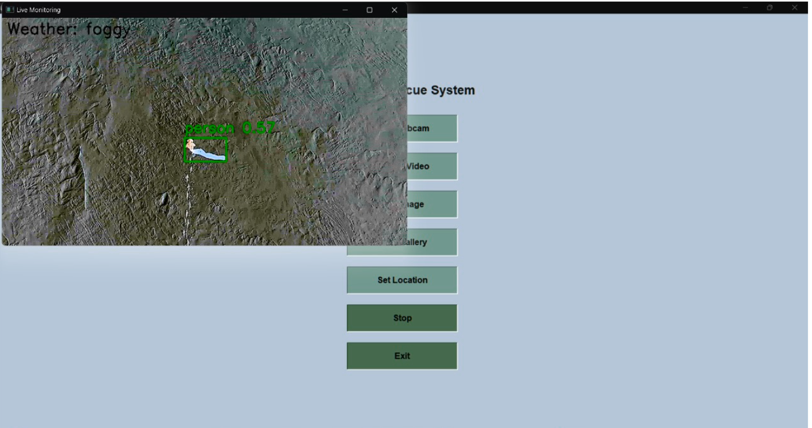

A person is detected in the above figure when a video is uploaded where the count increases for every detection in each frame along with the weather info and accuracy of detection.

---

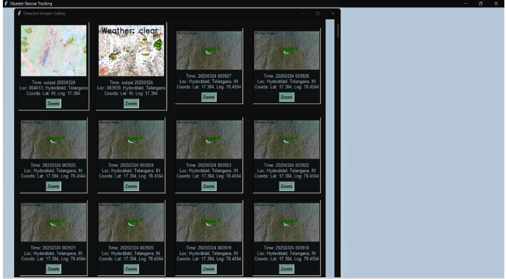

When we select the view gallery option, the above window is displayed where our previously detected frames are stored along with information like time, coordinates, and location of detection.

---

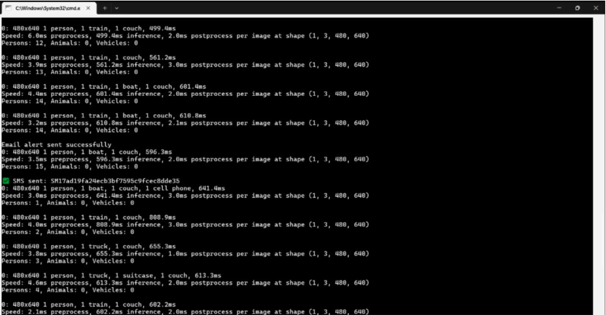

In the above figure, output is displayed in the console along with the information about the count of persons, animals, and vehicles detected.

---

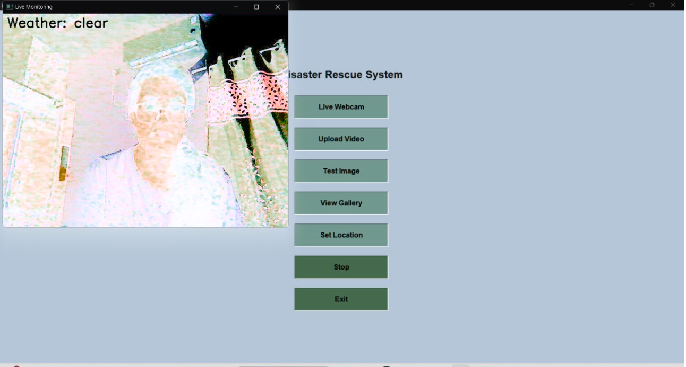

In the above figure, a person is detected with the help of a live webcam along with the weather information and detection accuracy.

---

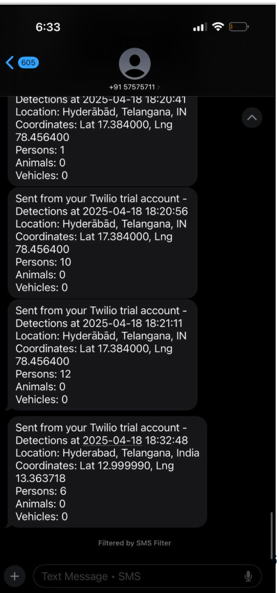

This is a screenshot of the SMS notification sent using Twilio API received on the mobile number of rescuer along with the time, date, location, coordinates, and count of persons, animals, and vehicles detected.

---

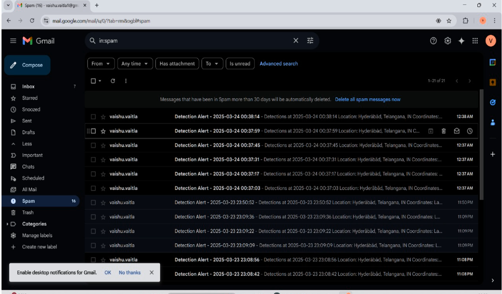

This figure shows the content of the mail received when a person, animal, or vehicle is detected. Information like location, coordinates, count of detections, etc., is present in the content.

---

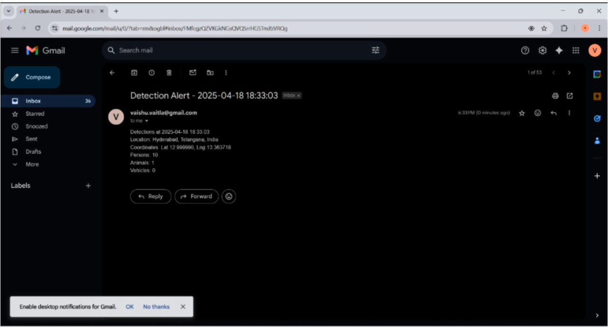

This figure shows the mail notifications that we get when a person, animal or vehicle is detected.

---

# 📊 Output

The system provides:

* Detected objects with confidence scores
* Bounding boxes on humans and objects
* Location (manual or IP-based)
* Console statistics
* SMS + Email alerts

---

# 🚀 Future Enhancements

* Improve accuracy with custom-trained dataset
* Add GPS integration
* Deploy as web application
* Add real-time drone surveillance

---

# 👩‍💻 Author

**Vaishnavi Vaitla**
GitHub: https://github.com/vaishnavi12345678999
LinkedIn: https://www.linkedin.com/in/vaishnavi-vaitla-360a1a225

---

# 📜 License

This project currently does not use a specific license. It is intended for educational and research purposes.
